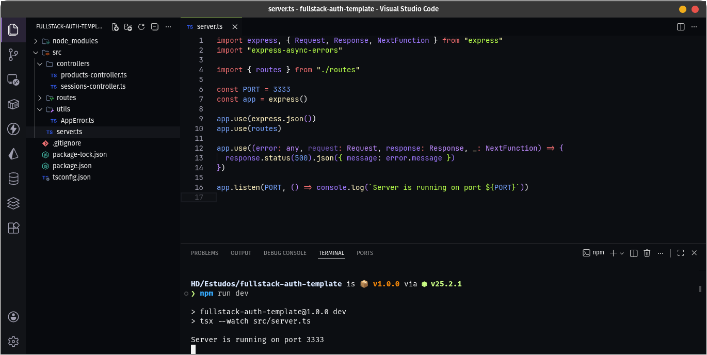

# J-Code Theme for VS Code

**J-Code** é um tema escuro minimalista e profissional para Visual Studio Code, projetado para oferecer máxima legibilidade, contraste agradável e destaque claro de tipos, funções e variáveis. Ideal para desenvolvedores que buscam foco e estética limpa no código.

---

## Características

- Tema escuro com paleta de cores cuidadosamente selecionada.
- Destaque diferenciado para tipos, funções, classes, variáveis e keywords.
- Contraste alto para melhor leitura de strings, números e comentários.
- Suporte completo para **semantic highlighting**.

---

## Autor

**João**
Tema desenvolvido e mantido por João, inspirado em minimalismo, clareza e produtividade.

---

## Licença

MIT License – use, compartilhe e adapte livremente.
